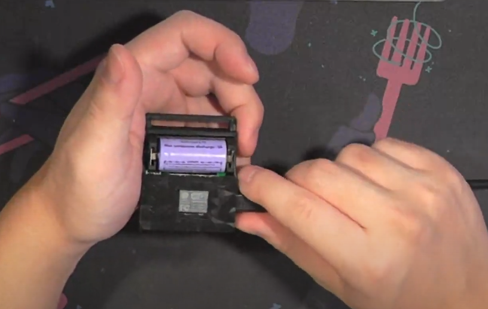
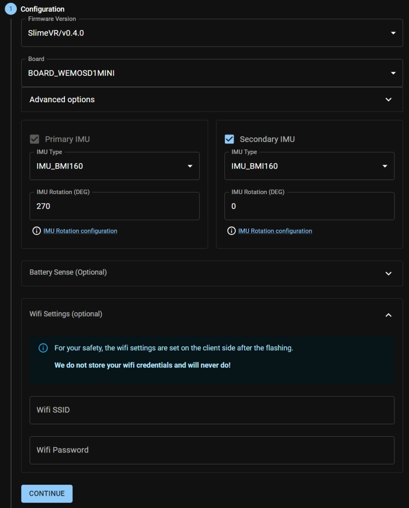
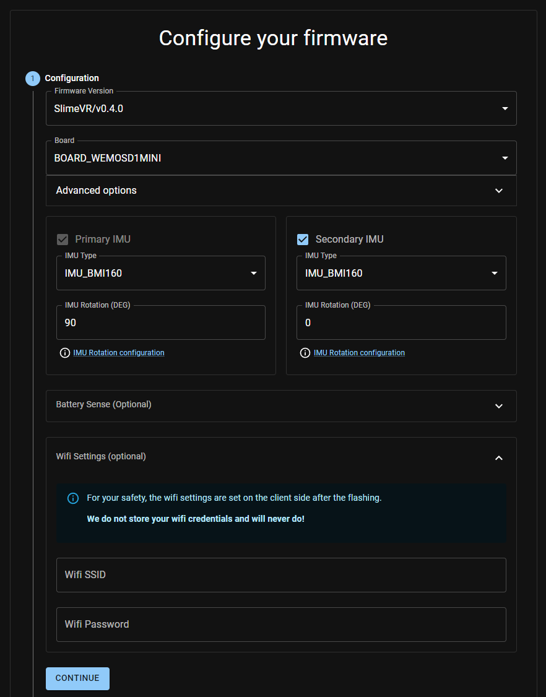

This is a setup and usage guide for AceStacks v1.x Trackers. You can find the purchase link for the trackers below.

[Buy Acestacks Now](https://ko-fi.com/s/f68f3c7944){: .btn .btn--success .btn--large}

**This section will need minor updates for Acestacks v2! The quickstart should still work fine. Message me @ "acerola." on Discord if you need any assistance.**

# Quickstart Guide
1. Watch the [AceStacks Video Overview](https://youtu.be/jQLkWUqJBMk) to familiarize yourself with the tracker design
<!-- <iframe width="560" height="315" src="https://www.youtube.com/embed/jQLkWUqJBMk?si=a3TqpI3CbrxZEM_t" title="YouTube video player" frameborder="0" allow="accelerometer; autoplay; clipboard-write; encrypted-media; gyroscope; picture-in-picture; web-share" allowfullscreen></iframe> -->

2. [Download and install the SlimeVR Server](https://slimevr.dev/download), which will also download the required USB drivers
3. Video Installation Guide: SlimeVR Set Up Guide (Part 1): Installation
<!-- <iframe width="560" height="315" src="https://www.youtube.com/embed/-QNFBxM2rY0?si=YHP9oWp4eWbpYZSF" title="YouTube video player" frameborder="0" allow="accelerometer; autoplay; clipboard-write; encrypted-media; gyroscope; picture-in-picture; web-share" allowfullscreen></iframe> -->
   - [Quick Setup Text Guide](https://docs.slimevr.dev/quick-setup.html)
   - [Detailed Setup Text Guide](https://docs.slimevr.dev/server/index.html)
1. Follow the Official SlimeVR Setup Guide, but do note that there are differences with this design
   1. [Video Setup Guide: SlimeVR Set Up Guide (Part 2): Setting Up!](https://www.youtube.com/watch?v=JrHmNcckpuE)
<!-- <iframe width="560" height="315" src="https://www.youtube.com/embed/JrHmNcckpuE?si=ofR9sMih33G13Hap" title="YouTube video player" frameborder="0" allow="accelerometer; autoplay; clipboard-write; encrypted-media; gyroscope; picture-in-picture; web-share" allowfullscreen></iframe> -->
   - The data cable for connecting the trackers to your server is the TOP MICRO USB port, the bottom USB C port is only for charging. use the top Micro USB for port this step.
   - If you have Acestacks V1, refer to [these extra safety steps](#acestacks-v1-extra-steps)

1. Follow the USB Connection Tolerances section if you’re having trouble connecting the trackers to your computer
2. Take note of the [Battery Safety Tips](#battery-safety) to prevent damage to the tracker
3. Take note of the [Mounting information](#mounting)
4. Refer to either/both of these resources for calibration and mounting tips
   - [ZRock35's Calibration Video](https://www.youtube.com/watch?v=SYqfQdVseF4)
   - [Spazznyans SlimeVR infographics](https://imgur.com/a/0jSuwrz)
5.  SlimeVR hosts official Calibrate and Chat events every Friday @ 7PM EST, which is the best place to get a good calibration done and meet fellow SlimeVR users. 

## Acestacks v1 Extra Steps
1. [0:22](https://youtu.be/JrHmNcckpuE?t=22), if using AceStacks v1, use these steps instead
   1. Leave the tracker OFF and connect a micro USB cable to the top port, you should hear the windows connect sound
   2. Connect the tracker until you see it pop up in the server
   3. DISCONNECT the tracker and then power it on, it should reappear in the server list, meaning that it is properly configured for your network
   4. Repeat for each tracker

## VRChat Quirks
The Inverse Kinematics for VRChat is lacking 

1. Try Hip Lock and Head Lock in VRChat to see which works better for you, hip lock seems to be the preference. NEVER use both
2. Make sure the height setting in VRChat is accurate, play around to see what works best
3. Use Height and not armspan
4. Check your calibration range in VRChat IK settings, lower it from .4 to .25
5. Immediately confirm calibration after a reset within slime

# Acestacks Specific Information
There are some design differences with Acestacks compared to the official SlimeVR tracker design, and also other DIY trackers. This section will discuss 

## USB Ports
Acestacks has two different USB ports
1. The bottom USB-C Port is ONLY for charging
2. The top Micro USB Port is for data
   - This port will be used to initially load in your Wi-Fi credentials when you are first setting up the trackers
   - This port is also used to access the serial console for debugging, and to flash new firmware for updates

**Placeholder for Images**

## Battery Safety
AceStacks uses 16340 Li-Ion cells, that can be charged using the built in USB C port on the bottom of the tracker or externally using an appropriate Li-Ion Charger.

### Warnings (FOLLOW PRECAUTIONS OR RISK DAMAGE TO THE TRACKERS):

{: .notice--danger}
**If replacing the battery**, such as to place fresh ones in or if one fell out, make sure to place the battery polarity correctly; The battery has a flat negative pole, and a button top positive pole
- Follow the battery holder markings for + and -
- The negative pole should be closer to the side with the data and charging port, and the positive side should be on the opposite side. **Placing the battery in the wrong polarity and turning on the tracker will damage the tracker**

#### Acestacks V1 IMPORTANT INFO

{: .notice--danger}
If you have AceStacks V1, the trackers cannot be charged while they are on, **MAKE SURE THE TRACKERS ARE OFF BEFORE CHARGING THEM** Leaving the trackers on and connected via USB backfeeds 5V into the battery, which can lead to **damaged batteries and potential fires**
   - V1.1+ has battery protection diodes, so it is safe to have the tracker plugged in while it is on

## USB Connection Tolerances
This problem should mostly be resolved in Acestacks v1.1+, but if you're still having trouble getting the trackers to connect to your computer via Micro USB, refer to this section. The Micro USB port is mounted quite far into the tracker, a quirk of the D1 Mini MCU design. Here are some tips on how to get a good data connection for initial configuration of the tracker.

1. Apply pressure using your other hand or against a table to seat the micro USB connector further to get a better connection.

2. Trim back the sheathing on the USB connector, to allow further insertion

3. [Nuclear option](https://youtu.be/jQLkWUqJBMk?t=73), partially disassemble the tracker and remove the MCU to directly connect a cable to it without interference

## Mounting
SlimeVR trackers are programmed with a set orientation. As programmed, AceStacks should be worn on the body such that the USB ports are facing the ceiling. The Thigh trackers with the Garter add-on are reversed, so the ports will be facing down; this should be pretty intuitive if you have this strap setup. This only applies to using Manual Mounting.

## Body Mounting Locations
For best results, the trackers should be mounted where they are stable and will not shift from movement or your muscles and tendons moving them out of place.

1. **Chest**: Tracker In Front, above the breasts/wherever comfortable
2. **Hips**: Tracker in Front, where a belt buckle would sit
3. **Thighs**: Trackers on the outside of your leg (Left Thigh Tracker on the Left, and vice versa). I prefer to put them as high as the will go
4. **Ankles**: Trackers on the outside of your ankle
5. **Feet**: Top of the foot
6. **Elbows**: On the back/tricep, or on the side of your upper arm. Center on your arm or place slightly closer to the elbow

## Firmware Flashing
The firmware on Slime Trackers is regularly updated with new features. Flashing firmware onto the trackers may fix problematic trackers, or allow you to use your trackers if the SlimeVR server is not loading the Wi-Fi credentials correctly. Newer firmware may also contain improvements to tracking and usability that you may want to use.

The preferred way to flash SlimeVR trackers is using Butterscotch's web configuration tool. [You can find the tool here.](https://slimevr-firmware.bscotch.ca/)

[Preconfigured v0.4.0 firmware for Acestacks](https://slimevr-firmware.bscotch.ca/?config=eyJib2FyZCI6eyJ0eXBlIjoiQk9BUkRfV0VNT1NEMU1JTkkiLCJwaW5zIjp7ImltdVNEQSI6IkQyIiwiaW11U0NMIjoiRDEiLCJsZWQiOiIyIn0sImVuYWJsZUxlZCI6dHJ1ZX0sImltdXMiOlt7InR5cGUiOiJJTVVfQk1JMTYwIiwiaW11SU5UIjoiRDUiLCJlbmFibGVkIjp0cnVlLCJyb3RhdGlvbiI6IjI3MCJ9LHsiZW5hYmxlZCI6dHJ1ZSwidHlwZSI6IklNVV9CTUkxNjAiLCJyb3RhdGlvbiI6MH1dLCJiYXR0ZXJ5Ijp7InR5cGUiOiJCQVRfRVhURVJOQUwiLCJyZXNpc3RhbmNlIjoxODAsInBpbiI6IkEwIn0sInZlcnNpb24iOiJTbGltZVZSL3YwLjQuMCJ9), just add your Wi-Fi credentials

[Preconfigured v0.4.0 firmware for Acestacks THIGH W/ GARTER STRAP](https://slimevr-firmware.bscotch.ca/?config=eyJib2FyZCI6eyJ0eXBlIjoiQk9BUkRfV0VNT1NEMU1JTkkiLCJwaW5zIjp7ImltdVNEQSI6IkQyIiwiaW11U0NMIjoiRDEiLCJsZWQiOiIyIn0sImVuYWJsZUxlZCI6dHJ1ZX0sImltdXMiOlt7InR5cGUiOiJJTVVfQk1JMTYwIiwiaW11SU5UIjoiRDUiLCJlbmFibGVkIjp0cnVlLCJyb3RhdGlvbiI6IjI3MCJ9LHsiZW5hYmxlZCI6dHJ1ZSwidHlwZSI6IklNVV9CTUkxNjAiLCJyb3RhdGlvbiI6MH1dLCJiYXR0ZXJ5Ijp7InR5cGUiOiJCQVRfRVhURVJOQUwiLCJyZXNpc3RhbmNlIjoxODAsInBpbiI6IkEwIn0sInZlcnNpb24iOiJTbGltZVZSL3YwLjQuMCJ9), just add your Wi-Fi credentials

# FAQ
1. You will not be able to use Autobone if you have programs such as OVR Advanced Settings open, since the playspace shifting will interfere with the autobone/automatic proportions. Make sure to disable these tools if you're having trouble.
2. If the server is simply not configuring the tracker properly, there is a brute force method to reflash the trackers with your wifi credentials using the SlimeVR Online Firmware Flasher.
3. If you run into any problems with the tracker, reflashing firmware might fix the problem. If you’re still having problems, there is a small chance that the calibration data on the tracker got corrupted. You can factory reset the tracker in the SlimeVR Server Serial Console, but you will have to redo AT LEAST the 6-point calibration.
