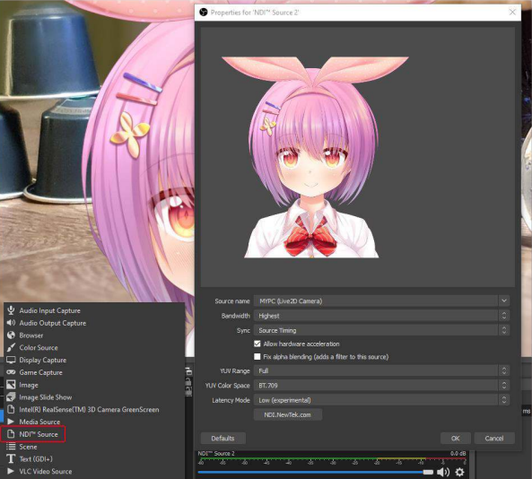
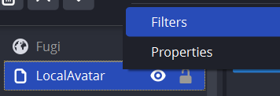
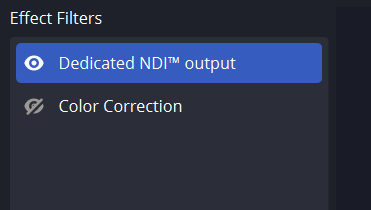

This guide will go over full-motion vtuber model sharing for collaborations using NDI Bridge.

[here is a sample of the method in use](https://clips.twitch.tv/RichSpunkyKittenKevinTurtle-vsNY9Trzwmfb-qhc)

[another sample](https://clips.twitch.tv/LaconicTastyFalconSoonerLater-gtZlHRUHPW_lpWt_)

# Quickstart Guide
If you are just interested in setting up NDI Bridge for model sharing, follow these steps.
### Setup
1. Download NDI Core
   - [Go here and Click on “For Windows”](https://ndi.video/tools/ndi-core-suite/)
   - [Direct Download](https://go.ndi.video/tools-for-windows)
   - Make sure to install NDI Core and not NDI SDK, which is for developing software using NDI
2. Install NDI Core
   - When you install, you can put anything for the name and email (email format)
3. [Download and install the latest release of OBS-NDI](https://github.com/obs-ndi/obs-ndi/releases)
   - [Direct Download Windows Installer](https://github.com/obs-ndi/obs-ndi/releases/download/4.13.1/obs-ndi-4.13.1-windows-x64-Installer.exe)
4. Set up your model as an NDI Source
   - 2D/VTS Users, activate the NDI toggle in the “Camera Settings” tab
   3D Vtubers
   - For VSeeFace, add an NDI Source Output Filter to your model source in OBS
   - In VNyan, go to Settings -> Graphics -> Use NDI and enable
5. Check to see that your model is sharing using OBS
   - Add a new source to your OBS Scene, NDI Source
   - In the dropdown, you should see your model being shared
### Using NDI Bridge
1. Joining an NDI Bridge
   - Open NDI Bridge, go to the Join Tab
   - Have the host send you the IP address, port, and encryption key
   - Paste the information into their respective places, do not copy the "field"=, just the value, and join
2. Hosting an NDI Bridge
   - [Port Forward the NDI Bridge Port (default: 5990)](#port-forwarding)
   - Open NDI Bridge, go to the Host Tab
   - Start hosting
Copy and send your IP, port, and encryption key to collaborators
3. [NDI Settings](#encoding-settings)
8. When all collaborators are connected, you should see new NDI Sources for their models/whatever they are sharing over NDI

## Detailed Guide
### What is NDI?
TL;DR - Free software/protocol used to transmit audio/video (AV) over network.

“Network Device Interface (NDI) is a royalty-free software specification developed by NewTek to enable video-compatible products to communicate, deliver, and receive high-definition video over a computer network in a high-quality, low-latency manner that is frame accurate and suitable for switching in a live production environment.” -Wikipedia

### What are some uses for NDI (for streaming)?
OBS has a plugin that integrates NewTek NDI into OBS Studio, allowing you to add and export NDI sources. (Palakis/obs-ndi Documentation)
1. **NDI Source:** add NDI Sources into OBS like any traditional source
2. **NDI Output:** transmit the main program view over NDI
3. **NDI Filter:** a special OBS filter that outputs its parent OBS source to NDI (audio works only with video capture sources, media sources and VLC sources)

Discovery is also dead simple for NDI; sources being broadcasted on a network will automatically be detected if everything is configured properly.

#### Here are some examples of NDI uses for streaming
1. Using separate computers/phones for multiple camera feeds/angles for a livestream
2. Dual-computer streaming setups, where a gaming computer can send uncompressed audio and video over NDI to another computer, which would then handle encoding and streaming to Twitch. Find more info and a [video tutorial here](https://www.youtube.com/watch?v=4q1rXLcXRLM)
3. Displaying a VTube Studio (VTS) model, though this method adds some latency and processing load compared to game capture. This method of avatar composition does have inherent transparency and hides the UI when changing settings on VTS. For more info, go to the [VTS Documentation, Page 37, Section 10.](https://denchisoft.com/wp-content/uploads/2021/08/VTube_Studio_Documentation_1_9_14_a.pdf)

### NDI for Model Sharing
NDI is typically used to share AV sources on a local network, but using NDI Bridge, you can join two or more networks and share NDI sources between them. Paired with NDI | HX, which allows you to compress NDI signals, you can easily share your model and other NDI sources over the internet.

#### Benefits and Comparisons
This is similar to VDO.Ninja and the more recent VTube Studio VNet Multiplayer for sharing full motion Vtuber models but with some extra benefits.

1. NDI supports alpha transparency, meaning that you won’t have to apply a luma key or chroma key to remove the background from a VDO browser source
2. NDI is much higher quality compared to VDO, and shows none of the softness or random quality drops of VDO, even on low settings
3. NDI will remember a source, meaning that you won’t have to remake and share a new VDO link to load in a model
4. NDI scales better with more than 2 people, since joining and 5. NDI Bridge will automatically share sources between all bridge members
   - I’ve tested this method with up to 4 people total
5. NDI is free, compared to VTS VNet Multiplayer
6. NDI supports any type of VTuber (PNG, 3D, and Live2D)
7. NDI is not limited to just sharing models, and can share ANY video or audio source in OBS, or whole OBS scenes

#### Downsides to This Method of Avatar Sharing
1. This method is sensitive to poor internet connections. You will need good internet download/upload speeds, and preferably be on an ethernet connection for this to work well. Wifi networks that I have tested this on caused models to stutter.
   - A new option for adding a buffer can help compensate for any microstuttering, but this will not 
2. There is additional setup compared to other options such as VDO.
3. NDI Bridge does not play nicely with AMD CPUs and GPUs, and it does not look like there is encoding support using AMD’s GPU encoder. Trying to use NDI \| HX (compression) will result in a slideshow
   - Using NDI High Bandwidth will circumvent compression and fix the issue, at the cost of SIGNIFICANTLY/10x the network load
4. If you use a hardware encoder like Intel QSV or NVENC for OBS, using OBS and NDI at the same time may overload your encoder, causing performance issues for both your stream and model. This depends a lot on your CPU and GPU.
   - One collaborator/model + GPU seems to work fine with most setups
   - Intel QSV struggled with 4 models at the same time, while NVidia
   - One way to prevent overloading your encoder is to just encode the NDI Bridge and to use CPU encoding for your stream, with the obvious downside of more CPU load.

### Download/Prerequisites
1. **NDI Core Suite,** to access NDI Bridge
   1. [Download](https://ndi.video/tools/ndi-core-suite/)
2. **OBS-NDI,** for OBS to interface with NDI and NDI Sources
   1. [Download](https://github.com/obs-ndi/obs-ndi/releases)
3. **Port Forwarding,** for hosts NDI session to communicate with client sessions
   - [Reddit Guide](https://www.reddit.com/r/HomeNetworking/comments/i7ijiz/a_guide_to_port_forwarding/)
   - [No IP Guide](https://www.noip.com/support/knowledgebase/general-port-forwarding-guide)

### Setup Instructions

#### Download and Install NDI Core
1. Download NDI Core
   - [Go here and Click on “For Windows”](https://ndi.video/tools/ndi-core-suite/)
   - [Direct Download](https://go.ndi.video/tools-for-windows)
   - Make sure to install NDI Core and not NDI SDK, which is for developing software using NDI
2. Install NDI Core
   - When you install, you can put anything for the name and email (email format)

#### Download and Install OBS-NDI
1. [Download and install the latest release of OBS-NDI](https://github.com/obs-ndi/obs-ndi/releases)
   - [Direct Download Windows Installer](https://github.com/obs-ndi/obs-ndi/releases/download/4.13.1/obs-ndi-4.13.1-windows-x64-Installer.exe)

If you've installed correctly, you should see new options for OBS sources called "NDI Source"

#### Configuring NDI on your Local Network and Importing a Model
1. Download and install OBS-NDI, the installer should automatically install the NDI runtime and  find your OBS Studio folder and install the plugin in the proper location.
2. For VTS users, activate the NDI toggle in the “Camera Settings” tab
3. In OBS, add a source to your scene and select “NDI Source”
4. If everything is configured properly, you should be able to add an NDI source, and to find a Source name being exported by VTS
5. The VTS recommended settings for adding a model using NDI can be seen below

#### Setting NDI Bridge
In the NDI Launcher, select and launch Bridge

##### Encoding Settings
Whether you’re hosting or joining a bridge, you’ll want to configure your encoding settings for the best experience for your and other participants. Here are my recommended settings, though other settings may work better for you and your participants.

1. Output: NDI | HX to encode the signal and be able to send it over internet
   - NDI High Bandwidth might be needed in some situations, such as for AMD only computers, but this will increase network load 10x
2. Encoder: H.264, still looks good and has better compatibility compared to HEVC
3. NDI 4 Compatibility: Leave off, but check this on if you have problems with the connection
4. Quality: Low/Med, this will look perfectly fine for model sharing. Lower quality will be easier to transmit over the internet but may incur a higher encoding load. Play around with this settings to see what works best/what you’re happiest with.

##### Port Forwarding
NDI Bridge needs to be port forwarded for participants to connect over the internet. You must manually configure your router and network port forwarding. This depends a lot on your router and how your network is set up, you can find more info here:
- [Reddit Guide](https://www.reddit.com/r/HomeNetworking/comments/i7ijiz/a_guide_to_port_forwarding/)
- [No IP Guide](https://www.noip.com/support/knowledgebase/general-port-forwarding-guide)

##### Host Bridge Settings
1. **Groups to Share:** Public
2. **Bridge Name:** the name of your bridge; how sources you share will be named
3. **Public IP Address:** should auto-populate with your public facing IP
4. **Port:** defaulted to 5990
5. **Encryption Key:** random key generated for your Bridge session, like a password

##### Join Bridge Settings
1. **Groups to Share:** Public
2. **Bridge Name:** the name of your bridge; how sources you share will be named
3. **Public IP Address:** Copied from the Host, the host’s public facing IP
4. **Port:** Copied from the Host, defaulted to Port 5990 for NDI
5. **Encryption Key:** Copied from the Host

#### Extra Steps for VSeeFace (VSF)
add an NDI filter to your avatar source in OBS to export your 3d model.
Go to your avatar source in OBS and open filters

Add a new “Dedicated NDI output” filter

Name the filter what you want the source to appear as for your partner

This method will cause your model to freeze on your partners’ ends when you’re on a scene that doesn’t have your avatar as a source. This works best for how I have my setup configured, where I have a master scene that contains mine and other avatars, that is then shared as a scene source in all of my other scenes.

## Further Explorations
With NDI and NDI Bridge, the possibilities are not limited to just sharing Vtuber models with other people. Anything that can be exported as an NDI source can be shared among participants; one possible use case is having a collaboration partner share their point of view via NDI. Another thing to test is how many people can collaborate and share sources at the same time. Currently, I’ve only tested with two people, and I’m curious as to what the upper limit is for shared NDI sources and collaborators.